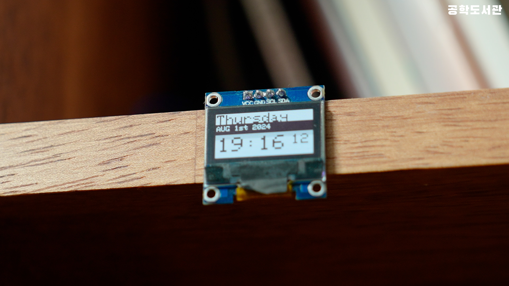
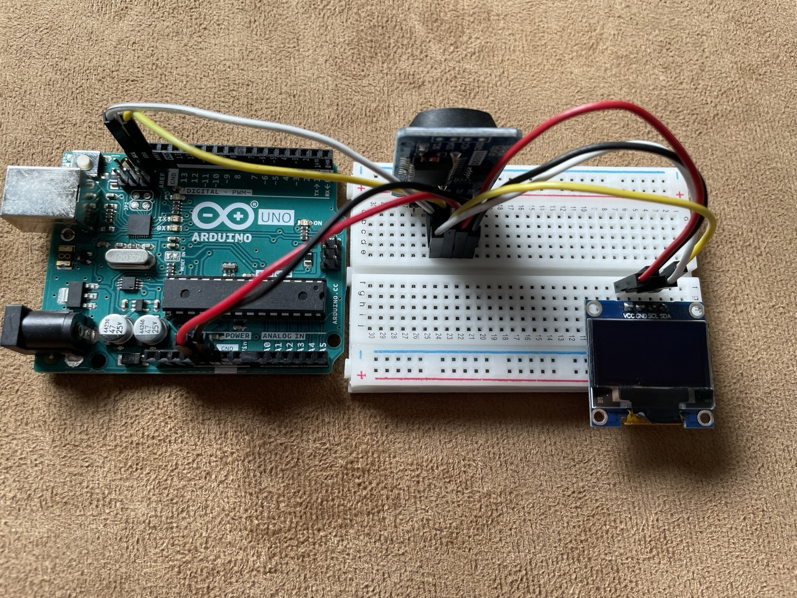

# 🎬 공학도서관 오리지널 컨텐츠

# ⏰ 시계 만들기

## 📝 프로젝트 소개
이 프로젝트는 아두이노와 RTC(Real-Time Clock) 모듈, OLED 디스플레이를 활용하여 정전 후에도 정확한 시간을 유지하는 시계를 만드는 과정을 설명합니다. 날짜, 요일, 시간을 한눈에 볼 수 있는 디지털 시계를 직접 만들어볼 수 있습니다.

## 📚 사전학습
이 프로젝트를 시작하기 전에 아래 내용을 먼저 공부하고 오시면 좋아요.

- 아두이노 기초
  - 아두이노 IDE 설치하기
  - I2C 통신 이해하기
  - 라이브러리 설치 방법 알아보기

- 전자부품 이해하기
  - OLED 디스플레이 사용법 알아보기
  - RTC 모듈의 개념 이해하기
  - I2C 통신 핀 찾아보기

- 프로그래밍 기초
  - 문자열 다루기
  - 시간 데이터 처리하기
  - 라이브러리 활용하기

## 🎯 성취 목표
- RTC 모듈에서 현재 시간을 읽어올 수 있다.
- OLED 디스플레이에 텍스트를 표시할 수 있다.
- 날짜와 시간 데이터를 원하는 형식으로 변환할 수 있다.
- 전원이 꺼져도 시간이 유지되는 시계를 만들 수 있다.
- 여러 라이브러리를 활용하여 하나의 프로젝트를 완성할 수 있다.

## 🛠 준비물
- 아두이노 우노 보드
- SSD1306 OLED 디스플레이
- DS3231 RTC 모듈
- CR2032 코인배터리
- M-M 점퍼선 8개
- USB 2.0 케이블 Type A/B

## 📋 회로 연결 방법

### RTC 모듈 연결
| Arduino UNO | DS3231 |
|------------|--------|
| A4 (SDA)   | SDA    |
| A5 (SCL)   | SCL    |
| 5V         | VCC    |
| GND        | GND    |

### OLED 디스플레이 연결
| Arduino UNO | SSD1306 |
|------------|---------|
| A4 (SDA)   | SDA     |
| A5 (SCL)   | SCL     |
| 5V         | VCC     |
| GND        | GND     |

> **주의**: I2C 통신을 사용하므로 SDA, SCL 핀 연결에 특히 주의하세요!

## 💾 실습 코드
| 파일명 | 설명 |
|--------|------|
| [Clock_v3.ino](./src/Clock_v3/Clock_v3.ino) | 시계 표시 기본 코드 |

## 💻 주요 함수 설명
1. `rtc.adjust(DateTime())`
   - RTC 모듈의 시간을 설정하는 함수
   - 컴파일 시간으로 자동 설정됨

2. `AddLeadingZero()`
   - 한 자리 숫자 앞에 0을 추가하는 함수
   - 시간 표시를 위해 사용

## ➡️ 순서도

## 🚀 시작하기
1. 회로를 제시된 도면대로 연결
   - I2C 연결 핀(SDA, SCL) 확인하기
   - 전원 연결 시 극성 확인하기

2. 라이브러리 설치하기
   - Arduino IDE에서 라이브러리 매니저 실행
   - RTClib 설치
   - Adafruit_SSD1306 설치
   - Adafruit_GFX 설치

3. 코드 업로드 준비
   - 아두이노와 컴퓨터 연결
   - 보드와 포트 선택
   - 예제 코드 다운로드

4. 코드 업로드하기
   - 코드 검증
   - 업로드 진행
   - 완료 메시지 확인

5. 시간 설정 및 확인
   - 초기 시간 설정 확인
   - 디스플레이 표시 확인
   - 배터리 연결 상태 점검

## 🔍 문제해결
- 디스플레이에 아무것도 표시되지 않아요
  - I2C 주소가 올바른지 확인해보세요. (기본값은 0x3C)
  - 라이브러리가 제대로 설치되었는지 확인해보세요.

- 시간이 틀려요
  - RTC 모듈의 배터리가 제대로 연결되었는지 확인해보세요.
  - `rtc.adjust()` 함수로 시간을 다시 설정해보세요.

- 글자가 깨져서 나와요
  - 디스플레이 초기화 코드를 확인해보세요.
  - I2C 연결이 느슨하지 않은지 살펴보세요.

## 🌟 이렇게 업그레이드 해볼 수 있어요
- 알람 기능을 추가해볼까요?
  정해진 시간에 부저가 울리도록 만들 수 있어요.

- D-Day 카운터를 만들어볼까요?
  특별한 날까지 남은 일수를 표시할 수 있어요.

- 온습도계를 추가해볼까요?
  RTC 모듈의 온도센서를 활용하면 시계와 온도계를 같이 만들 수 있어요.

## 📚 참고 자료
- [RTC 모듈이란?](https://ko.wikipedia.org/wiki/%EC%8B%A4%EC%8B%9C%EA%B0%84_%EC%8B%9C%EA%B3%84)
